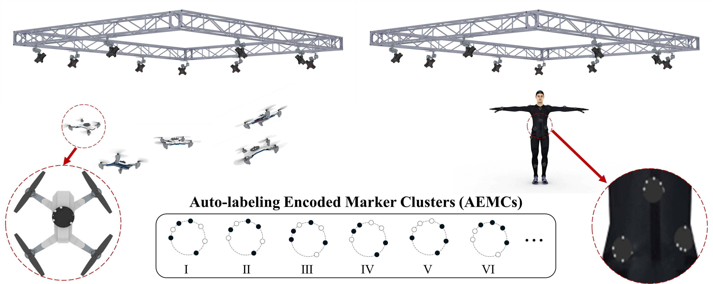
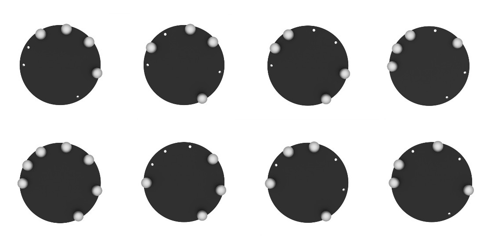
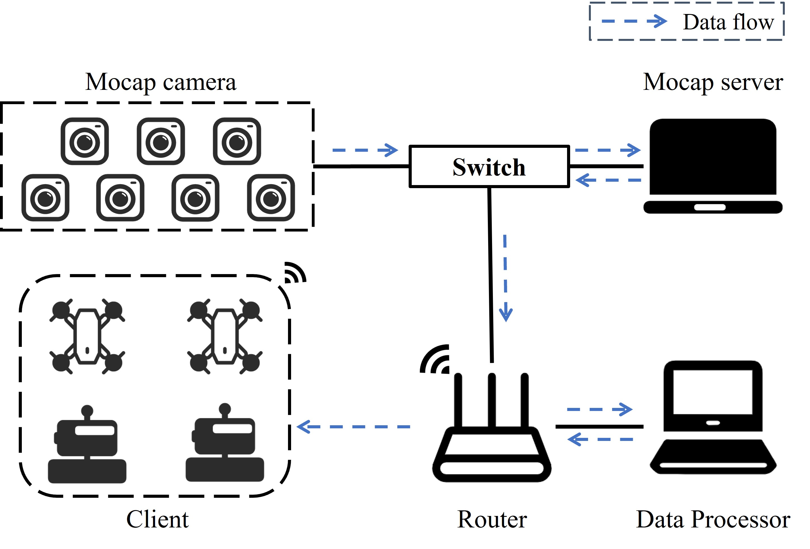

# Encoded Marker Clusters for Auto-Labeling in Optical Motion Capture

This project provides a novel framework for automating the labeling and matching of marker-based optical motion
capture (MoCap) data.

<div align=center>

</div>

## 1. AEMCs Design 
### a. Codewords Generation

### b. Base Design and Manufacturing



## 2. Usage in Post-Processing

After recording motion data using the MoCap system, export the 3D coordinates of all markers in each frame.

## 3. Usage in Real-Time

### a. System Setup and Configuration

Leveraging the real-time data streaming functionality of commercial MoCap software, by setting up the physical and data
layers as shown in the diagram, real-time pose information can be provided to different types of clients. Our algorithm
runs in the **Data Processor**.

<div align=center>

</div>

***Note:*** When acquiring the 3D points broadcasted by the motion capture system, due to differences in the support and
specific open interfaces of motion capture systems from different brands, specific modifications to this part of the
code are required.

### b. Prerequisites

- Ubuntu 22.04
- ROS2 Humble
- Eigen

### c. Install

```sh
  colcon build
```

### d. Use

```shell
ros2 run aemc_client aemc_client_node
```

```shell
ros2 topic echo /aemc_client_node/aemc_pose
```

### aemc_msgs (Output Message Type)

```
std_msgs/Header header
string id
geometry_msgs/Pose pose
float64 confidence
```


## 4. Comparison with Data-driven methods

### 1. vs. [SOMA](https://github.com/nghorbani/soma)

- Refer
  to [Run SOMA On MoCap Point Cloud Data](https://github.com/nghorbani/soma/tree/main/src/tutorials/run_soma_on_soma_dataset.ipynb)

### 2. vs. MoCap-solver

- Refer to https://github.com/NetEase-GameAI/MoCap-Solver  
  Modify SyntheticDataGeneration/generate_test_data.py

## 5. Citation

Please cite the following paper if you use this code directly or indirectly in your research/projects:

```
Encoded Marker Clusters for Auto-Labeling in Optical Motion Capture
```
