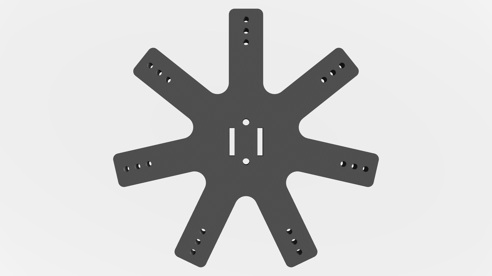

# Encoded Marker Clusters for Auto-Labeling in Optical Motion Capture

This project provides a novel framework for automating the labeling and matching of marker-based optical motion
capture (MoCap) data.

<div align=center>

</div>

## 1. AEMCs Design

### a. Principles for Selecting the Size of Reflective Markers

- Existing sizes of reflective markers
- Maximum size limitations of the application target

- Under the premise of meeting the size and quantity requirements, choose the largest possible reflective marker to
  enhance the MoCap system's recognition accuracy for the reflective markers.

### b. Codewords Generation

### c. Base Design and Manufacturing

#### Examples:

- **AEMCs-E (Size of reflective markers: 8mm, Code length of data bits: 7)**

Below is the design sketch of the Cluster base for AEMCs-E, along with
a [3D-printable model](/material/AEMC-E_with_7mm_markers.STL).

<div align=center>
    
</div>


<div align=center>

</div>

- **AEMCs-I (Size of reflective markers: 15mm, Code length of data bits: 7)**

Below is the design sketch of the Cluster base for AEMCs-I, along with
a [3D-printable model](/material/AEMC-I_with_15mm_markers.STL).

<div align=center>

</div> 

<div align=center>

</div>

### d. Extension

The above demonstrates the minimal design of two types of AEMCs based on reflective markers of specific sizes. In
addition to increasing the capacity of AEMCs by extending the codeword length, the capacity can also be increased by
expanding the diameter of the Cluster base. As shown below, three different AEMCs with varying base diameters are
designed on a single Cluster base, but with the same codeword length, they can still be accurately distinguished.

<div align=center>

</div>

## 2. Usage in Post-Processing

After recording motion data using the MoCap system, export the 3D coordinates of all markers in each frame.

## 3. Usage in Real-Time

### a. System Setup and Configuration

For real-time pose information streaming, set up the system using the configuration diagram below. This allows different
clients to receive the processed data seamlessly, with the core algorithm running within the **Data Processor** layer.

<div align=center>

</div>

> ***Note:***  
> Depending on the brand and specific interface of your MoCap system, you may need to modify certain parts of the code
> to accommodate the system's unique data broadcasting methods.

### b. Prerequisites

- **Ubuntu 22.04**
- **ROS2 Humble**
- **Eigen**

### c. Install

- **Install ROS2**: Follow the
  official [installation guide for ROS2 Humble on Ubuntu.](https://docs.ros.org/en/humble/Installation/Alternatives/Ubuntu-Development-Setup.html)

- **Clone this project** into the `src` directory of your ROS2 workspace.

```sh
  git clone https://github.com/paracosm-wh/AEMC.git
```

- **Build**

```sh
  colcon build
```

### d. Usage

After building the workspace, source the setup file and run the project as follows:

- **Source the workspace**:

```sh
source install/setup.bash
```

```sh
ros2 run aemc_client aemc_client_node
```

```sh
ros2 topic echo /aemc_markers
```

- **aemc_msgs (Output Message Type)**

```
std_msgs/Header header
string id
geometry_msgs/Pose pose
float64 confidence
```

## 4. Comparison with Data-driven methods

### a. vs. [SOMA](https://github.com/nghorbani/soma)

- Refer
  to [Run SOMA On MoCap Point Cloud Data](https://github.com/nghorbani/soma/tree/main/src/tutorials/run_soma_on_soma_dataset.ipynb)

### b. vs. MoCap-solver

- Refer to https://github.com/NetEase-GameAI/MoCap-Solver  
  Modify SyntheticDataGeneration/generate_test_data.py

## 5. Citation

Please cite the following paper if you use this code directly or indirectly in your research/projects:

```
Encoded Marker Clusters for Auto-Labeling in Optical Motion Capture
```
